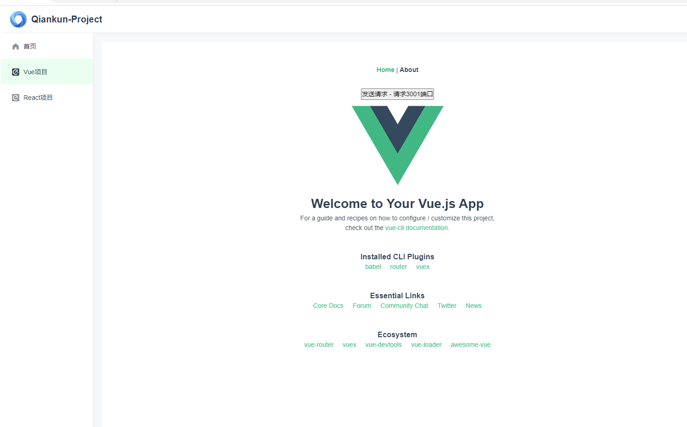
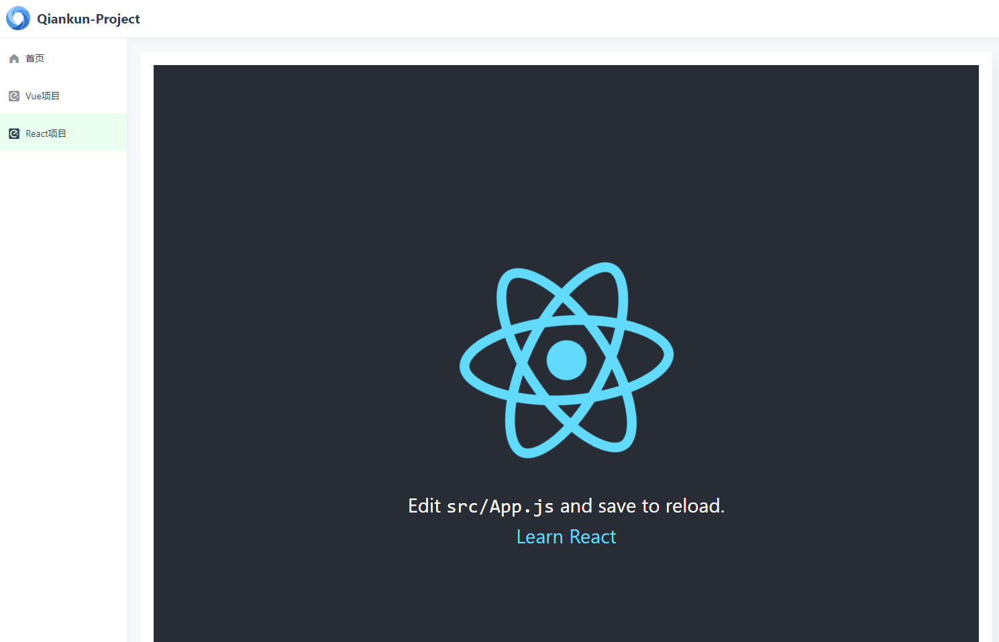
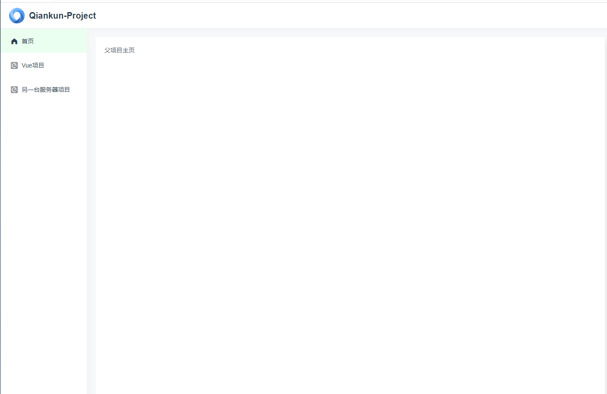

# qiankun微前端搭建vue和react，使用nginx部署相关注意事项
## 项目运行图片


## 项目部署后图片

## 运行项目
1. 下载父项目和子项目各自的依赖
2. 先运行子项目，再运行父项目。如果子项目端口有变化需要修改父项目里的配置，访问父项目查看效果
3. 父项目的配置信息在 qiankun-parent/src/default-app.js
4. 为了完整性，这里把nginx和node代码也放上来，方便快速搭建
```javascript
let apps
if (process.env.NODE_ENV === 'production') {
  // 打包 部署的配置
  apps = [ 
    {
      name:'qiankun-child-vue', // 应用的名字
      entry:'/child-vue/', // 默认会加载这个html 解析里面的js 动态的执行 （子应用必须支持跨域）fetch
      container:'#container', // 容器名
      activeRule:'/qiankun-child-vue' // 激活的路径
    },
    {
      name: 'app1',
      entry: '/app1/', // http://localhost:8080/app1/
      container: '#container',
      activeRule: '/child-app1',
    }
  ]
} else {
  // 开发运行配置
  apps = [ 
    {
      name:'qiankun-child-vue', // 应用的名字
      entry:'//localhost:10002', // 默认会加载这个html 解析里面的js 动态的执行 （子应用必须支持跨域）fetch
      container:'#container', // 容器名
      activeRule:'/qiankun-child-vue' // 激活的路径
    },
    {
      name:'qiankun-child-react', // 应用的名字
      entry:'//localhost:3000', // 默认会加载这个html 解析里面的js 动态的执行 （子应用必须支持跨域）fetch
      container:'#container', // 容器名
      activeRule:'/qiankun-child-react' // 激活的路径
    }
  ]
}

export default apps
```

## 新建vue子项目注意事项 -- 推荐参考官方文档[https://qiankun.umijs.org/zh]
1. 新建vue.config.js
```javascript
module.exports = {
    // 这里需要注意，将生产环境的地址改为和路由base保持一致
    /*
        const router = new VueRouter({
            routes,
            mode: 'history',
            base: window.__POWERED_BY_QIANKUN__ ? '/qiankun-child-vue' : '/',
        })
    */
    publicPath: process.env.NODE_ENV === 'production' ? '/qiankun-child-vue' : '/',
    devServer:{
        port: 10002,
        headers:{
            'Access-Control-Allow-Origin':'*' // 允许跨域
        }
    },
    configureWebpack:{
        output:{
            library:'qiankun-child-vue', // 项目名称
            libraryTarget:'umd' // 把微应用打包成 umd 库格式
        }
    }
}
```
2. 在 src 目录新增 public-path.js
```javascript
if (window.__POWERED_BY_QIANKUN__) {
  __webpack_public_path__ = window.__INJECTED_PUBLIC_PATH_BY_QIANKUN__;
}
```
3. 入口文件 main.js 修改，为了避免根 id #app 与其他的 DOM 冲突，需要限制查找范围。
```javascript
import './public-path'
import Vue from 'vue'
import App from './App.vue'
import router from './router'
import store from './store'

Vue.config.productionTip = false
let instance
function render(props = {}) {
  const { container } = props;
  instance = new Vue({
    router,
    store,
    render: h => h(App)
  }).$mount(container ? container.querySelector('#app') : '#app')
}


// 独立运行时
if (!window.__POWERED_BY_QIANKUN__) {
  render();
}

export async function bootstrap() {
  console.log('[vue] vue app bootstraped');
}
export async function mount(props) {
  console.log('[vue] props from main framework', props);
  render(props);
}
export async function unmount() {
  instance.$destroy();
  instance.$el.innerHTML = '';
  instance = null;
}
```
4. 修改router/index.js
```javascript
const router = new VueRouter({
  mode: 'history',
  base: window.__POWERED_BY_QIANKUN__ ? '/qiankun-child-vue' : '/', // 添加跳转前缀
  routes
})
```
5. 在父项目添加的配置
```javascript
{
    name:'qiankun-child-vue', // 子项目名称
    entry:'//localhost:10002', // 默认会加载这个html 解析里面的js 动态的执行 （子应用必须支持跨域）fetch
    container:'#container',
    activeRule:'/qiankun-child-vue', // 对应路由的 base
}
```

## 新建react子项目注意事项 -- 推荐参考官方文档[https://qiankun.umijs.org/zh]
1. 在 src 目录新增 public-path.js
```javascript
if (window.__POWERED_BY_QIANKUN__) {
  __webpack_public_path__ = window.__INJECTED_PUBLIC_PATH_BY_QIANKUN__;
}
```
2. 设置 history 模式路由的 base：
```javascript
<BrowserRouter basename={window.__POWERED_BY_QIANKUN__ ? '/qiankun-child-react' : '/'}>
```
3. 入口文件 index.js 修改，为了避免根 id #root 与其他的 DOM 冲突，需要限制查找范围。
4. 修改 webpack 配置

    - 安装插件 react-app-rewired。
      ```shell
        npm i -D react-app-rewired
      ```

    - 根目录新增 config-overrides.js：
      ```javascript
        module.exports = {
        webpack: function override(config, env) {
          config.output.library = `qiankun-child-react`;
          config.output.libraryTarget = 'umd';
          return config;
        },
        devServer: (configFunction) => {
          return function (proxy, allowedHost) {
            const config = configFunction(proxy, allowedHost);
            config.open = false;
            config.hot = false;
            config.port = 10003;
            config.headers = {
              'Access-Control-Allow-Origin': '*',
            };
            return config;
          };
        },
      };
      ```

    - 修改 package.json：
      ```
        -   "start": "react-scripts start",
        +   "start": "rescripts start",
        -   "build": "react-scripts build",
        +   "build": "rescripts build",
        -   "test": "react-scripts test",
        +   "test": "rescripts test",
        -   "eject": "react-scripts eject"
      ```

4. 在父项目添加的配置
```javascript
{
    name:'qiankun-child-react', // 子项目名称
    entry:'//localhost:3000', // 默认会加载这个html 解析里面的js 动态的执行 （子应用必须支持跨域）fetch
    container:'#container',
    activeRule:'/qiankun-child-react', // 对应路由的 base
}
```

## 在父项目里为子项目配置代理
1. 这里为了模拟接口使用node+express运行两个服务器
    需要运行一下node-server/src目录下的两个服务
```
node node-server/src/api-vue.js
node node-server/src/api-react.js
```
2. 在qiankun-parent/vue.config.js
```javascript
// 服务项配置    
devServer: {
    // 设置代理proxy
    proxy: {
        "/qiankun-child-vue/api": {
            target: "http://localhost:7001", // Vue项目
            changeOrigin: true,
            ws: true,
            pathRewrite: {
                "^/qiankun-child-vue/api": ""
            }
        },
        "/qiankun-child-react/api": {
            target: "http://localhost:7002", // React项目
            changeOrigin: true,
            ws: true,
            pathRewrite: {
                "^/qiankun-child-react/api": ""
            }
        }
    }
}
```
3. 在子项目中发送代理的路径发送请求即可
```javascript
axios.get('/qiankun-child-vue/api/hello').then(res => console.log(res))
```

## nginx部署 （父项目和子项目部署在同一个服务器上）
- 注意子项目文件夹需和子项目打包时的publicPath对应
```
publicPath: process.env.NODE_ENV === 'production' ? '/child-vue' : '/',
```
1. 父项目和子项目部署在同一个服务器上
└── html/                     # 根文件夹
    |
    ├── child-vue/            # 存放Vue项目 需和项目打包时的publicPath对应
    ├── index.html            # 主应用的index.html
    ├── css/                  # 主应用的css文件夹
    ├── js/                   # 主应用的js文件夹

2. nginx配置
```
server {
  listen       8001;
  server_name  localhost;

  location / {
    root   html;
    index  index.html index.htm;
    try_files $uri $uri/ /index.html;
  }

  # 避免刷新时出现404的情况
  location /qiankun-child-vue/ {
    root   html;
    index  index.html index.htm;
    try_files $uri $uri/ /qiankun-child-vue/index.html;
  }
  # 代理vue项目请求
  location /qiankun-child-vue/api/ {
      proxy_pass http://localhost:3001;
      rewrite "^/qiankun-child-vue/api/(.*)$" /$1 break;
      proxy_set_header Host $host:$server_port;
  }
}
```
 
## 将子项目部署到另一台服务器 使用 Nginx 代理访问
- 一般这么做是因为不允许主应用跨域访问微应用，做法就是将主应用服务器上一个特殊路径的请求全部转发到微应用的服务器上，即通过代理实现“微应用部署在主应用服务器上”的效果。

例如，主应用在 A 服务器，微应用在 B 服务器，使用路径 /child-app1 来区分微应用，即 A 服务器上所有 /child-app1 开头的请求都转发到 B 服务器上。

此时主应用的 Nginx 代理配置为：
```
/app1/ {
  proxy_pass http://localhost:8002/app1/;
  proxy_set_header Host $host:$server_port;
}
```
- 主应用注册微应用时，entry 可以为相对路径，activeRule 不可以和 entry 一样（否则主应用页面刷新就变成微应用）：
```
{
  name: 'app1',
  entry: '/app1/', // http://localhost:8080/app1/
  container: '#container',
  activeRule: '/child-app1',
},
```
- 对于 webpack 构建的微应用，微应用的 webpack 打包的 publicPath 需要配置成 /app1/，否则微应用的 index.html 能正确请求，但是微应用 index.html 里面的 js/css 路径不会带上 /app1/。

```javascript
  module.exports = {
    output: {
      publicPath: `/app1/`,
    },
  };
```
- 微应用打包的 publicPath 加上 /app1/ 之后，必须部署在 /app1 目录，否则无法独立访问。

- 新起一个nginx服务，端口设置为 8002，将打包好的静态文件放到 /app1目录下


### 部署的方法都差不多，这里只写了vue项目的部署


